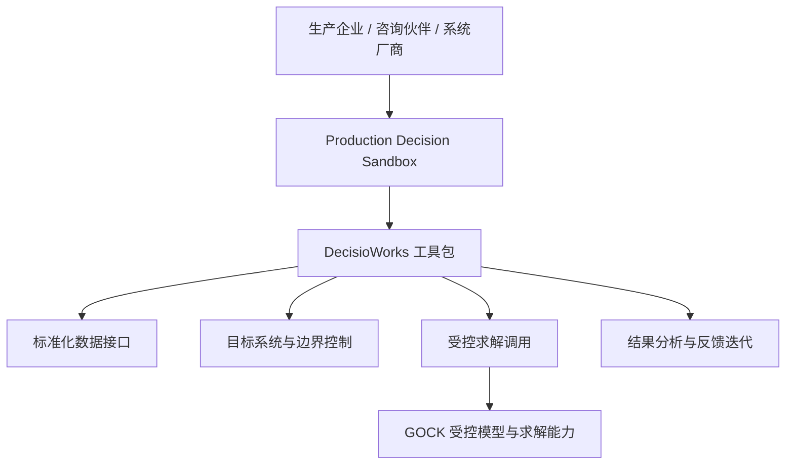
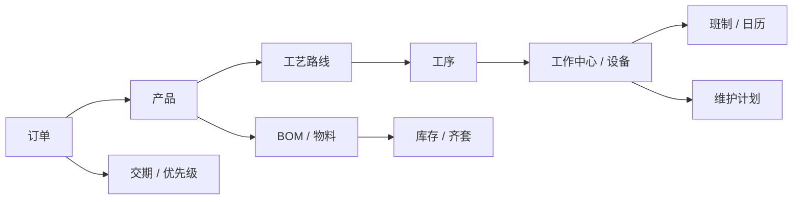

# Production Decision Sandbox 设计文档

> 项目中文工作名：生产决策沙盘系统  
> 英文目录名：`production-decision-sandbox`  
> 定位：围绕 DecisioWorks 的可视化试点、数据诊断、流程编排、教学与生态服务系统  
> 版本：V0.2 设计稿  
> 日期：2026-08-22

---

## 1. 背景与定位

生产决策系统的落地难点，通常不在“有没有一个漂亮界面”，也不只在“有没有一个优化算法”，而在于企业能否把现场数据、业务语义、约束边界、目标偏好、求解结果和复核反馈组织成一条持续运行的能力链。

传统 APS 或生产排程项目往往存在以下问题：

- **启动成本高**：项目一开始就进入重实施、重调研、重定制，客户很难在早期判断是否值得投入。
- **验证链路弱**：数据是否可用、业务关系是否闭合、模型边界是否清楚、结果是否可解释，往往要到项目中后期才暴露。
- **现场变化快**：订单、产能、物料、设备、班制、维护计划、交期承诺和管理偏好持续变化，交付时固化的规则很快失效。
- **人工修正多**：计划员频繁手工调整结果，但人工调整很容易破坏原有约束和目标闭环，使优化结果失去可信度。
- **生态协作难**：MES、ERP、WMS、咨询伙伴和系统集成商各自掌握一部分现场信息，但缺少轻量、可视、可验证的协作入口。

`Production Decision Sandbox` 的目标不是重新做一个大而全 APS 系统，而是为 DecisioWorks 提供一个“沙盘化”的应用层入口：

> 用可视化方式把 DecisioWorks 的数据接入、语义映射、能力编排、边界设置、求解调用、结果分析和反馈迭代呈现出来，使客户、咨询伙伴、系统厂商和试点团队可以先看到问题、验证链路、形成模板，再决定如何进入正式集成或项目落地。

---

## 2. 产品定义

### 2.1 一句话定义

生产决策沙盘系统，是一个面向制造业计划与排程场景的可视化验证平台，用于把 DecisioWorks 工具包的使用过程转化为可配置、可运行、可复核、可沉淀的项目视图。

### 2.2 核心价值

- **把数据变成业务视图**：不只是导入表格，而是展示订单、产品、物料、工艺、资源、日历、库存、维护计划之间的业务关系。
- **把配置变成能力编排**：不只是填写参数，而是让数据校验、场景选择、目标设置、边界控制、求解运行和结果分析形成可视流程。
- **把结果变成复核证据**：不只是输出甘特图，而是展示负载、交期、瓶颈、冲突、约束命中、方案差异和下一轮调整依据。
- **把试点变成模板资产**：不只是做一次 demo，而是沉淀可复用的数据模板、场景模板、配置模板和报告模板。
- **把工具包变成生态入口**：客户、咨询伙伴、MES/ERP 厂商和系统集成商可以围绕沙盘形成协作，而不需要接触 GOCK 内核细节。

### 2.3 不做什么

- 不替代 ERP、MES、WMS、SCM 等业务系统。
- 不替代 DecisioWorks 工具包本身。
- 不暴露 GOCK 内部模型、求解实现和商业秘密。
- 不承诺“一套系统解决所有生产决策问题”。
- 不把企业现场流程固化成唯一标准答案。


### 2.4 外围服务边界

Sandbox 的核心不是扩展 DecisioWorks 的求解能力，而是把 DecisioWorks 的使用过程服务化、可视化和可教学化。它围绕五类外围服务展开：

1. **诊断服务**：帮助用户判断数据是否具备进入标准化数据接口和真实求解链路的条件；
2. **编排服务**：帮助用户理解和组织 DecisioWorks 标准动作、Recipe 与运行证据；
3. **案例服务**：把现场经验、偏好和规则沉淀为可复核、可插入、可比较的案例；
4. **Agent 服务**：把数据诊断、流程配置、运行复核和报告生成整理为结构化 AI Agent 任务包；
5. **教学服务**：把 DecisioWorks 的使用路径转化为分角色、可练习、可检查的学习内容。

这些服务共同构成 DecisioWorks 的外围能力层。外围服务越清楚，DecisioWorks 越容易被客户、伙伴和产业渠道理解；边界越清楚，GOCK 内核与商业秘密越安全。

---

## 3. 与 DecisioWorks / GOCK 的关系

### 3.1 分层关系



### 3.2 边界说明

- **Production Decision Sandbox**：公司名下可形成的软件产品与软著资产，负责可视化、交互、模板、项目管理和试点协作。
- **DecisioWorks**：生产决策能力工具包，负责标准化数据接口、业务表达、能力编排、求解调用、结果分析等基础能力。
- **GOCK**：受控模型能力与求解能力沉淀，仅通过 DecisioWorks 的授权接口被调用，不作为沙盘系统的可见源码或直接依赖对象。

### 3.3 资产策略

沙盘系统适合放在公司名下形成独立软件资产：

- 对外展示公司具备产品化、工程化和交付协作能力；
- 与个人名下 DecisioWorks / GOCK 能力保持清晰授权边界；
- 可用于后续软著申请、政策申报、渠道对接和试点合作；
- 可作为公司主体承接产业沟通、客户试点和生态伙伴共建的前台应用。

---

## 4. 目标用户与典型场景

| 用户类型 | 典型诉求 | 沙盘系统价值 |
|---|---|---|
| 制造企业管理层 | 判断生产决策系统是否值得投入 | 用真实或脱敏数据快速验证问题、效果和边界 |
| 计划/排程团队 | 看清数据、规则、目标和结果之间的关系 | 用可视方式复核计划结果和调整依据 |
| MES / ERP 厂商 | 希望补齐生产决策能力 | 通过标准接口和模板快速验证集成路径 |
| 咨询伙伴 | 从方案建议走向可验证结果 | 把诊断、改善方案和指标分析转成可运行证据 |
| 园区/产业渠道 | 希望识别可落地项目 | 用轻量沙盘展示产品能力、试点路径和合作边界 |

典型使用场景：

1. **售前沟通**：导入样例数据或客户脱敏数据，展示从数据准备到结果分析的完整链路。
2. **客户试点**：围绕某车间、某产品族、某条产线，验证数据质量、业务闭合和结果解释。
3. **咨询交付增强**：咨询伙伴把诊断结论转化为可运行沙盘，形成“方案 + 仿真 + 验证 + 改善路径”。
4. **系统集成验证**：MES / ERP 厂商验证如何从自身系统导出数据，再调用 DecisioWorks 能力。
5. **数据共建计划**：客户提供合格数据场景，沙盘系统生成数据质量报告、场景说明和模板沉淀。
6. **内部能力演进**：企业逐步沉淀自己的订单、工艺、资源、日历、库存、维护、目标和约束模板。

---

## 5. 总体设计原则

### 5.1 先验证，后实施

系统默认服务于“低成本验证”，而不是一开始进入重型实施。每一个试点都应回答：

- 数据是否可进入；
- 业务关系是否闭合；
- 目标与边界是否可表达；
- 结果是否可解释；
- 偏差是否能反馈到下一轮。

### 5.2 数据即业务

系统不把数据视为孤立字段，而是把字段背后的业务对象和关系显式展示出来。

核心对象包括：

- 订单、客户、交期、优先级；
- 产品、BOM、物料、库存、齐套；
- 工艺路线、工序、工作中心、设备；
- 日历、班制、维护计划、停机窗口；
- 资源能力、换型、批量、节拍；
- 目标偏好、约束边界、异常反馈。

### 5.3 能力可编排

系统不把 DecisioWorks 的调用隐藏成一个黑盒按钮，而是把关键能力节点可视化：

- 数据导入；
- 数据校验；
- 场景选择；
- 目标设置；
- 边界控制；
- 求解运行；
- 结果分析；
- 方案对比；
- 反馈迭代。

### 5.4 内核受控

沙盘系统只展示可授权、可解释、可集成的接口层与结果层，不展示 GOCK 内部实现。

核心原则：

- 不暴露 GOCK 源码；
- 不展示商业秘密模型细节；
- 不允许绕过 DecisioWorks 授权；
- 不把求解器能力无限开放；
- 不把沙盘系统变成未授权求解入口。

### 5.5 能力可演化

沙盘系统的最终价值不是一次演示，而是让企业、咨询伙伴和系统厂商围绕同一套可视化证据持续迭代。

---

## 6. 总体架构

```mermaid
flowchart LR
    subgraph Frontend["前端可视化层"]
        UI["项目工作台"]
        Table["数据表与质量视图"]
        Graph["业务关系图"]
        Flow["能力编排图"]
        Gantt["计划/排程时间轴"]
        Charts["指标与分析图表"]
        Report["报告与模板导出"]
    end

    subgraph API["沙盘服务层"]
        Project["项目管理"]
        Dataset["数据集管理"]
        Scenario["场景管理"]
        Recipe["流程/Recipe 管理"]
        Run["运行记录"]
        View["视图状态"]
    end

    subgraph Adapter["DecisioWorks 适配层"]
        DataAdapter["数据接口适配"]
        RecipeAdapter["能力编排适配"]
        SolverAdapter["受控求解适配"]
        ResultAdapter["结果标准化适配"]
    end

    subgraph Core["DecisioWorks 能力层"]
        DataDB["data.db / 数据合同"]
        Business["Business"]
        Model["Model"]
        Solver["Solver"]
        Analysis["Result Analysis"]
    end

    Frontend --> API --> Adapter --> Core
```



### 6.1 技术形态建议

- **前端**：React + TypeScript + Vite。
- **组件体系**：Ant Design 作为基础 UI；必要时引入 ProComponents。
- **图表**：Apache ECharts 作为通用指标图与自定义图表基础。
- **流程/关系图**：MVP 优先 React Flow；复杂图编辑与连接关系可升级 AntV X6。
- **甘特/时间轴**：MVP 可优先 vis-timeline；正式排程展示可评估 DHTMLX Gantt Community Edition 或商业版本。
- **后端**：FastAPI 或现有 DecisioWorks API 适配层。
- **数据存储**：SQLite + 文件项目空间；后续可扩展 PostgreSQL。
- **部署形态**：本地部署优先，适配客户内网与演示环境。

---

## 7. 核心模块设计

### 7.1 项目工作台

用于组织一个客户、一个试点或一个演示样例。

主要功能：

- 创建项目；
- 绑定数据集；
- 选择业务场景；
- 管理运行记录；
- 查看输出报告；
- 沉淀项目模板。

核心字段：

| 字段 | 说明 |
|---|---|
| project_id | 项目唯一标识 |
| project_name | 项目名称 |
| industry | 行业或产品类型 |
| scenario_type | 计划、排程、齐套、产能、维护等场景 |
| data_scope | 数据范围说明 |
| owner | 项目负责人或合作方 |
| created_at | 创建时间 |
| status | 草稿、验证中、已完成、归档 |

### 7.2 数据集管理与质量视图

数据集管理模块负责把客户提供的 `data.db`、CSV、Excel、接口导出文件、映射说明和业务描述组织成可检查对象。

主要功能：

- 数据集导入；
- 表结构识别；
- 字段完整性检查；
- 主外键关系检查；
- 空值、重复、异常范围检查；
- 时间字段、数量字段、资源字段校验；
- 数据脱敏状态记录；
- 数据质量评分与问题清单。

可视化方式：

- 表格视图；
- 数据质量卡片；
- 缺失字段热力图；
- 业务对象覆盖图；
- 关系闭合图。

### 7.3 业务关系视图

业务关系视图用于展示数据背后的制造语义，而不是只展示字段。



用途：

- 帮助客户理解“为什么数据准备不是填表”；
- 帮助咨询伙伴识别业务关系缺口；
- 帮助系统厂商确认接口映射责任；
- 帮助内部团队沉淀数据模板。

### 7.4 场景配置模块

场景配置模块用于描述当前要验证的问题边界。

典型场景：

- 主生产计划；
- 车间作业排程；
- 产能负载分析；
- 物料齐套分析；
- 维护计划影响分析；
- 订单优先级调整；
- 多方案对比；
- 异常扰动复核。

配置内容：

- 计划范围；
- 时间窗口；
- 资源范围；
- 产品范围；
- 订单范围；
- 目标偏好；
- 约束启停；
- 运行参数；
- 输出视图。

### 7.5 能力编排视图

能力编排视图是沙盘系统的关键，不是展示“流程图好看”，而是让 DecisioWorks 的使用路径可见。


节点信息包括：

- 输入对象；
- 输出对象；
- 参数说明；
- 状态；
- 错误信息；
- 运行耗时；
- 关联文件；
- 可复用模板。

### 7.6 模型边界视图

模型边界视图只展示可公开、可解释的抽象层，不展示 GOCK 内部实现。

可展示内容：

- 业务对象如何进入模型；
- 哪些约束被启用；
- 哪些目标被启用；
- 哪些边界控制项影响求解；
- 结果指标如何回到业务语义。

不展示内容：

- GOCK 内部源码；
- 核心建模公式细节；
- 求解策略细节；
- 授权控制实现；
- 可被复制的商业秘密参数与算法组织方式。

### 7.7 计划与排程视图

计划与排程视图建议分层展示：

- **计划层**：订单满足、产品计划、产能负载、物料缺口、交期风险。
- **排程层**：工序、设备、开始结束时间、等待、换型、维护窗口、冲突。
- **分析层**：瓶颈资源、负载峰值、延期订单、异常工序、约束命中。
- **复核层**：结果解释、人工调整影响、下一轮建议。

推荐视图：

- 甘特图；
- 资源负载图；
- 订单交期图；
- 物料短缺图；
- 瓶颈排行；
- 冲突清单；
- 方案差异矩阵。

### 7.8 结果分析与反馈迭代

结果分析不能只停留在“是否跑出结果”，而要回答：

- 为什么这个订单延期；
- 为什么这个资源成为瓶颈；
- 哪些维护计划影响了排程；
- 哪些物料约束造成等待；
- 哪些目标偏好导致当前取舍；
- 如果调整边界，结果如何变化；
- 下一轮需要补充什么数据。

输出内容：

- 运行摘要；
- 核心指标；
- 问题清单；
- 约束命中；
- 瓶颈说明；
- 方案对比；
- 下一轮数据准备建议；
- 可导出的 PDF / DOCX / PPT 报告。

---

## 8. 数据与接口设计

### 8.1 项目目录结构建议

```text
production-decision-sandbox/
  DESIGN.md
  README.md
  docs/
    architecture.md
    visual-resource-research.md
    data-contract.md
    pilot-template.md
  apps/
    web/
  services/
    api/
  packages/
    visual-model/
    decisioworks-adapter/
    report-exporter/
  templates/
    manufacturing-basic/
    aps-data-check/
    scheduling-pilot/
  examples/
    demo-mps/
    demo-scheduling/
  assets/
    diagrams/
    screenshots/
```

### 8.2 数据对象

| 对象 | 说明 |
|---|---|
| SandboxProject | 一个沙盘项目或试点项目 |
| Dataset | 一组导入数据及其质量检查结果 |
| BusinessObject | 订单、产品、工艺、资源等业务对象 |
| Scenario | 一次业务问题定义与验证范围 |
| Recipe | 一条能力编排流程 |
| Run | 一次运行记录 |
| Result | 计划、排程、分析等输出结果 |
| ViewState | 前端视图布局与筛选状态 |
| Template | 可复用的数据、场景、流程或报告模板 |

### 8.3 DecisioWorks 适配接口

沙盘系统不应直接耦合 GOCK 内核，而应通过 DecisioWorks 暴露的授权接口或命令行进行调用。

建议适配层：

- `DataAdapter`：读取或生成 `data.db`、映射说明和数据质量报告。
- `ScenarioAdapter`：把沙盘场景配置转为 DecisioWorks 可识别的配置对象。
- `RecipeAdapter`：管理标准动作、流程编排和运行链路。
- `SolverAdapter`：调用受控求解能力，记录授权状态、参数、耗时和输出。
- `ResultAdapter`：把结果转为前端统一 DTO，例如甘特条、指标卡、冲突项、瓶颈项。

### 8.4 输出物

每个试点项目建议形成以下输出：

- `data_quality_report`：数据质量与业务闭合报告；
- `scenario_config`：场景配置记录；
- `run_record`：运行参数、版本、耗时、授权状态；
- `result_snapshot`：计划或排程结果快照；
- `analysis_report`：瓶颈、负载、交期、冲突与解释；
- `next_iteration_plan`：下一轮数据、边界或目标调整建议；
- `project_template`：可复用项目模板。

---

## 9. 可视化资源调研与选型

以下资源以“可用、成熟、适合本地部署、适合工业数据表达”为优先考虑。正式集成前仍需逐项复核许可证、版本、商业使用限制和依赖安全性。

### 9.1 资源矩阵

| 资源 | 官方地址 | 适用位置 | 初步判断 |
|---|---|---|---|
| Apache ECharts | https://echarts.apache.org/en/index.html | KPI、负载、产能、短缺、交期、趋势、热力图、自定义图表 | 首选通用图表库，适合稳定沉淀为基础图表能力 |
| ECharts Custom Series | https://echarts.apache.org/handbook/en/how-to/custom-series/ | 自定义甘特条、资源占用条、冲突标记、时间窗口 | 可用于补足标准图表无法表达的工业排程视图 |
| Ant Design | https://ant.design/components/overview/ | 表单、表格、布局、步骤条、弹窗、导航 | 适合作为企业级前端基础组件体系 |
| Ant Design Table | https://ant.design/components/table/ | 数据检查、字段映射、运行记录、问题清单 | 适合数据表密集型业务页面 |
| TanStack Table | https://tanstack.com/table/latest/docs/overview | 大表格、Headless 表格、复杂筛选排序 | 适合后续处理更大规模数据表，但 UI 需自行设计 |
| React Flow | https://reactflow.dev/ | 能力编排、流程节点、Recipe 可视化 | MVP 阶段适合快速做出可交互流程编辑器 |
| AntV X6 | https://x6.antv.antgroup.com/en/tutorial/about | 数据关系图、流程图、可编辑 DAG、复杂节点连接 | 适合中后期构建更强图编辑与图建模能力 |
| AntV G6 | https://g6.antv.antgroup.com/en/manual/graph/option | 业务关系网络、数据血缘、对象关系图 | 适合展示订单、物料、工艺、资源之间的复杂网络 |
| vis-timeline | https://visjs.github.io/vis-timeline/ | 轻量时间轴、设备任务、维护窗口、班制展示 | 适合 MVP 先做可用的排程时间轴 |
| DHTMLX Gantt | https://dhtmlx.com/docs/products/dhtmlxGantt/open-source/ | 专业甘特图、任务层级、依赖关系 | 适合正式甘特图展示；高级功能需关注商业授权 |
| bpmn-js | https://bpmn.io/toolkit/bpmn-js/ | BPMN 流程建模、正式流程表达 | 若未来需要咨询交付或流程标准化，可作为扩展选择 |
| ELKJS | https://github.com/kieler/elkjs | 自动布局、层级图、流程图布局 | 适合作为 React Flow / X6 的布局引擎补充 |
| Cytoscape.js | https://js.cytoscape.org/ | 图网络分析、复杂关系可视化 | 对业务关系网络有价值，但 MVP 可暂缓 |
| Plotly.js | https://plotly.com/javascript/ | 统计图、3D 图、分析型图表 | 可作为分析增强库，不建议一开始替代 ECharts |
| deck.gl | https://deck.gl/docs | 大规模 WebGL / WebGPU 可视化 | 适合超大规模或地理/空间场景，当前不是 MVP 必需 |
| Apache Superset | https://superset.apache.org/ | 外部 BI 仪表板、数据探索 | 可作为后续集成选项，不建议作为沙盘核心前端 |
| Grafana | https://grafana.com/docs/grafana/latest/visualizations/dashboards/ | 运行监控、指标面板、系统状态 | 适合运维和监控，不适合作为业务沙盘主界面 |
| Mermaid | https://mermaid.js.org/intro/ | 文档图、设计图、技术文章图 | 适合文档表达，不适合作为核心交互系统 |

### 9.2 MVP 推荐组合

MVP 阶段建议保持轻量：

- **React + TypeScript + Vite**：前端工程基础。
- **Ant Design**：企业级页面、表单、表格、步骤条。
- **Apache ECharts**：指标图、负载图、瓶颈图、方案对比图。
- **React Flow**：能力编排与流程节点。
- **vis-timeline**：轻量排程时间轴与维护窗口展示。
- **FastAPI + SQLite**：本地服务与项目数据管理。
- **DecisioWorks Adapter**：对接工具包能力，不触碰 GOCK 内核。

### 9.3 第二阶段增强组合

当沙盘进入客户试点或渠道演示后，可增加：

- **AntV X6**：更复杂的数据关系图和可编辑能力图；
- **AntV G6**：制造业务对象关系网络；
- **DHTMLX Gantt**：更正式的甘特图呈现；
- **ELKJS / @antv/layout**：自动布局；
- **报告导出模块**：DOCX / PDF / PPT 输出；
- **模板库**：行业模板、数据模板、试点模板。

### 9.4 暂不建议一开始引入的资源

- **Superset / Grafana**：能力强，但会把沙盘系统带向 BI 或监控平台，不适合作为 MVP 主界面。
- **deck.gl**：适合大规模空间数据，不是当前生产计划与排程沙盘的核心需求。
- **复杂低代码平台**：容易把重点从生产决策能力链转移到页面搭建，反而削弱产品边界。
- **重型 BPMN 引擎**：除非咨询交付明确需要 BPMN 标准，否则不宜过早引入。

---

## 10. 页面与视图设计

### 10.1 首页：项目总览

目标：让用户快速理解当前项目是否具备试点条件。

页面内容：

- 项目卡片；
- 数据集状态；
- 最近运行记录；
- 核心指标；
- 未解决问题；
- 下一步建议。

### 10.2 数据准备页

目标：把“客户需要提供什么数据”变成可检查的页面。

页面内容：

- 数据对象列表；
- 必填字段检查；
- 业务关系检查；
- 数据质量评分；
- 脱敏状态；
- 缺口清单；
- 导出数据准备报告。

### 10.3 业务关系页

目标：显示现场数据是否已经形成可计算业务语义。

页面内容：

- 订单到产品关系；
- 产品到 BOM 关系；
- 产品到工艺路线关系；
- 工序到资源关系；
- 资源到日历/班制/维护计划关系；
- 物料到库存/齐套关系；
- 交期与优先级关系。

### 10.4 场景配置页

目标：定义本次试点要解决的问题，不把所有问题一次塞进系统。

页面内容：

- 场景类型选择；
- 数据范围选择；
- 时间窗口选择；
- 资源范围选择；
- 目标偏好设置；
- 约束启停；
- 运行参数；
- 保存为模板。

### 10.5 能力编排页

目标：把 DecisioWorks 的运行链路可视化。

页面内容：

- 节点式流程；
- 节点状态；
- 输入输出说明；
- 参数查看；
- 运行日志；
- 错误定位；
- 复制为新流程。

### 10.6 求解运行页

目标：以受控方式发起运行。

页面内容：

- 当前数据集；
- 当前场景；
- 当前授权等级；
- 求解参数；
- 运行边界；
- 开始/停止；
- 运行日志；
- 输出文件。

### 10.7 结果分析页

目标：把结果从“看见排程”推进到“理解为什么”。

页面内容：

- 总体 KPI；
- 资源负载；
- 交期满足；
- 瓶颈资源；
- 物料短缺；
- 维护窗口影响；
- 约束命中；
- 异常清单；
- 建议下一轮调整。

### 10.8 方案对比页

目标：支持客户理解不同目标、边界和数据条件下的结果差异。

页面内容：

- 两个或多个运行记录选择；
- KPI 差异；
- 延期订单差异；
- 资源负载差异；
- 冲突数量差异；
- 关键变化解释；
- 推荐复核点。

### 10.9 模板库页

目标：沉淀可复用能力。

模板类型：

- 数据准备模板；
- 字段映射模板；
- 试点场景模板；
- 目标配置模板；
- 能力编排模板；
- 报告模板；
- 行业样例模板。

---

## 11. 可视化重点设计

### 11.1 数据可表达

用表格、检查项和关系图回答：

- 数据有没有；
- 字段对不对；
- 关系通不通；
- 是否足以进入计算；
- 哪些业务对象缺失。

### 11.2 业务可计算

用关系图和配置页回答：

- 订单如何关联产品；
- 产品如何关联工艺；
- 工艺如何占用资源；
- 资源如何受日历和维护影响；
- 物料如何影响可行性。

### 11.3 过程可编排

用流程节点回答：

- 哪些能力被调用；
- 调用顺序是什么；
- 每个节点输入输出是什么；
- 节点失败在哪里；
- 如何复用为模板。

### 11.4 结果可复核

用甘特图、负载图、瓶颈图和差异图回答：

- 为什么这样排；
- 哪里是瓶颈；
- 哪些订单延期；
- 哪些约束被命中；
- 调整后影响在哪里。

### 11.5 能力可演化

用项目历史、模板库和反馈迭代回答：

- 本轮验证沉淀了什么；
- 下一轮需要补什么数据；
- 哪些模板可以复用；
- 企业能力如何继续生长。

---

## 12. MVP 路线图

### 阶段 0：设计与资产边界确认

目标：明确沙盘系统与 DecisioWorks / GOCK / 公司资产之间的边界。

交付物：

- 本设计文档；
- 资源选型清单；
- 初始页面原型；
- 软著名称与功能边界草案。

### 阶段 1：项目与数据工作台

目标：先把“数据是否能进来”做清楚。

功能：

- 项目创建；
- 数据集导入；
- 数据表浏览；
- 字段检查；
- 数据质量报告；
- 业务对象覆盖率。

### 阶段 2：业务关系与场景配置

目标：把数据从字段层推进到业务语义层。

功能：

- 业务对象关系图；
- 场景选择；
- 目标配置；
- 边界设置；
- 场景模板保存。

### 阶段 3：能力编排与运行记录

目标：把 DecisioWorks 的调用过程可视化。

功能：

- 能力节点图；
- Recipe 配置；
- 运行参数；
- 求解调用记录；
- 错误状态展示。

### 阶段 4：结果展示与分析

目标：让试点结果可复核、可解释、可对比。

功能：

- 计划结果概览；
- 排程时间轴；
- 资源负载；
- 交期分析；
- 瓶颈分析；
- 方案对比；
- 报告导出。

### 阶段 5：模板化与对外试点

目标：形成可传播、可复用、可共建的外部资产。

功能：

- 行业模板；
- 数据共建模板；
- 咨询伙伴模板；
- MES / ERP 集成模板；
- 试点报告包；
- 演示素材包。

---

## 13. 商业与对外沟通边界

### 13.1 对外表达

建议表达为：

> 生产决策沙盘系统把 DecisioWorks 的生产决策能力转化为可视化、可配置、可运行的试点入口。它帮助制造企业、咨询伙伴和系统厂商先用数据验证问题，再围绕目标、约束、结果和反馈逐步形成可演化的生产决策能力。

### 13.2 避免表达

- “替代所有 APS”；
- “自动解决全部排程问题”；
- “AI 自动做决策”；
- “无需业务参与”；
- “完整开放核心内核”；
- “交钥匙生产决策系统”。

### 13.3 与公司主体的关系

沙盘系统适合成为公司主体下的前台产品：

- 可展示公司产品能力；
- 可承接客户试点；
- 可生成软著资产；
- 可连接政策渠道；
- 可作为生态伙伴合作入口。

DecisioWorks / GOCK 可继续保持授权关系与核心边界，由公司获得使用权并对外形成可控服务或授权产品。

---

## 14. 安全与合规设计

### 14.1 数据安全

- 客户数据默认本地部署；
- 支持脱敏数据导入；
- 项目目录隔离；
- 运行记录不包含敏感明细；
- 导出报告可隐藏客户名称、产品编码和订单编号；
- 样例数据与客户数据分离。

### 14.2 商业秘密保护

- 不在沙盘系统中存放 GOCK 源码；
- 不展示 GOCK 内部建模细节；
- 不绕过 DecisioWorks 授权调用；
- 不输出可复制核心算法材料；
- 对外报告只展示业务解释与结果分析。

### 14.3 授权控制

- 记录 DecisioWorks 授权等级；
- 限制运行规模、运行次数或功能范围；
- 区分演示模式、试点模式、正式授权模式；
- 对导出报告标注运行环境与授权状态；
- 防止沙盘系统成为未授权求解入口。

---

## 15. 软著申请方向建议

可考虑软件名称：

- `生产决策沙盘系统 V1.0`
- `制造业生产决策沙盘软件 V1.0`
- `工业计划与排程沙盘验证系统 V1.0`
- `制造业决策能力可视化验证平台 V1.0`

推荐主名称：

> 制造业生产决策沙盘系统 V1.0

软件主要功能可围绕以下内容组织：

- 数据集导入与数据质量检查；
- 制造业务对象关系可视化；
- 生产决策场景配置；
- 目标、约束与边界参数配置；
- 能力编排流程可视化；
- 受控求解调用与运行记录；
- 计划与排程结果展示；
- 资源负载、交期、瓶颈与异常分析；
- 多方案对比；
- 试点报告与模板导出。

---

## 16. 风险与控制

| 风险 | 表现 | 控制方式 |
|---|---|---|
| 做成重型系统 | 页面越来越多，变成另一个 APS | 坚持沙盘、验证、模板、集成入口定位 |
| 暴露核心能力 | 图形化展示过深，泄露 GOCK 细节 | 只展示抽象模型边界与结果解释 |
| 可视化堆料 | 引入太多库，工程复杂度上升 | MVP 只选 Ant Design + ECharts + React Flow + 时间轴 |
| 客户误解为交钥匙 | 期待系统直接替代现场管理 | 明确“先验证后实施、能力在企业自身长起来” |
| 数据质量不稳定 | 客户提供数据不完整 | 数据质量视图和缺口报告作为第一阶段核心能力 |
| 授权边界模糊 | 沙盘绕开工具包授权 | 所有求解调用必须经过 DecisioWorks Adapter |

---

## 17. 推荐下一步

1. 在本目录下补充 `README.md`，定义项目愿景、边界和当前状态。
2. 生成第一版低保真页面原型，包括项目工作台、数据准备页、能力编排页、结果分析页。
3. 建立 `docs/visual-resource-research.md`，把可视化资源调研拆成独立技术选型文档。
4. 建立 `docs/data-contract.md`，说明沙盘系统如何读取 DecisioWorks 标准化数据接口相关数据。
5. 以一个演示数据集作为第一条端到端链路，验证“数据准备—场景配置—能力编排—运行结果—报告导出”。
6. 在公司成立后，可将该系统作为公司名下的外围产品和软著申请对象。

---

## 18. V0.2 产品边界与三端结构

V0.2 将 Production Decision Sandbox 从单一演示页面扩展为三个相互协作、数据边界清楚的产品面：

| 产品面 | 面向对象 | 主要职责 | 数据与运行边界 |
|---|---|---|---|
| GitHub Pages 公开门户 | 潜在用户、生态伙伴、学习者 | 项目介绍、能力地图、案例、教程、提示词模板、版本与下载入口 | 仅静态公开内容；不上传客户数据，不执行真实求解，不保存授权材料 |
| 本地 Sandbox | 计划人员、数据人员、实施与咨询伙伴 | 输入数据诊断、可视化流程编排、规则案例、教学练习、运行与方案对比 | 在本机或客户内网处理数据；通过适配层调用 DecisioWorks |
| DecisioWorks Adapter | Sandbox 与 DecisioWorks | 能力目录同步、配方转换、受控运行、结果标准化、证据回传 | 不接触 GOCK 内部实现；不提供任意代码执行入口 |

三端之间采用“公开内容与运行数据分离”的原则：公开门户负责让能力被理解，本地 Sandbox 负责让能力被练习和验证，DecisioWorks 负责真实的生产决策能力链。

---

## 19. 可视化流程编排器

### 19.1 目标

流程编排器不是通用低代码平台，而是 DecisioWorks 已注册能力的受控组合器。它把“能力编排配方（Recipe）”转化为用户可以阅读、编辑、校验和复用的流程图。

### 19.2 标准节点

首期节点应与 DecisioWorks 标准动作保持映射，至少包括：

- 数据读取与数据诊断；
- 约束解析与业务关系校验；
- 目标构建；
- 规则与经验装配；
- 方案生成；
- 方案选择；
- 结果评估；
- 计划释放与执行输出；
- 分析反馈与下一轮联动。

界面显示中文业务名称，节点详情中保留稳定技术标识，避免用户被内部模块名阻断理解。

### 19.3 交互结构

- **左侧节点库**：按数据、计划、排程、目标、规则、求解、分析和联动分类。
- **中部画布**：支持拖放、连线、缩放、自动布局和只读运行轨迹。
- **右侧属性面板**：编辑输入、输出、参数、启用条件、失败策略和证据要求。
- **底部运行面板**：展示节点状态、耗时、输入摘要、输出摘要、异常和审计记录。

### 19.4 编排约束

- 只能使用能力注册表中存在且当前授权允许的节点；
- 连线前检查输入输出类型，不允许任意对象互连；
- 设计阶段检查缺失节点、孤立节点、循环依赖、未绑定参数和无输出终点；
- 运行阶段保留节点级证据，不把整条流程压缩成一个“运行成功”提示；
- 支持流水线、DAG 和有限状态机三种已受控执行形态，不在首期开放任意循环和脚本节点；
- 编排结果导出为 DecisioWorks 可校验的 YAML 或 JSON 配方，而不是生成任意 Python 代码。

### 19.5 生命周期

流程模板采用“草稿、已校验、已发布、已归档”四态管理。每次运行记录配方版本、数据集版本、规则版本和 DecisioWorks 版本，确保结果可以复现。

---

## 20. 输入数据诊断中心

输入数据诊断应成为 Sandbox 的第一核心能力。它不只回答“文件能否读取”，还要判断数据能否准确表达业务并进入真实求解链路。

### 20.1 五层诊断

| 层级 | 诊断问题 | 典型输出 |
|---|---|---|
| 文件与结构 | 文件、表、字段、类型是否完整 | 缺表、缺字段、类型错误、不可读取文件 |
| 业务语义 | 单位、时间坐标、数量含义、状态值是否一致 | 时间单位不统一、百分比与绝对值混用、枚举无定义 |
| 关系闭合 | 订单、制品、工艺、资源、物料和日历能否关联 | 孤立制品、缺失工艺、无资源工序、物料关系断开 |
| 约束可用 | 产能、班制、维护、批量、齐套等是否足以构成约束 | 产能冲突、维护窗口重叠、齐套条件缺失 |
| 求解就绪 | 数据是否达到 ContractReady、ModelReady、SolverReady | 阶段结论、阻断项、警告项和建议修复顺序 |

### 20.2 页面能力

- 展示真实总行数、分页和筛选结果，避免用抽样行数冒充数据规模；
- 表头悬停显示字段中文含义、单位、来源和关联关系；
- 关系图支持从问题项反向定位到表、字段和具体记录；
- 问题按阻断、警告、建议三级展示；
- 修复建议说明“为什么影响求解”，不直接静默修改客户数据；
- 支持诊断前后对比，并导出 Markdown、JSON 和可打印报告；
- 对脱敏状态、客户标识和公开边界单独检查。

### 20.3 首批诊断案例

- `time_unit` 在交期、产能、齐套和计划结果中不一致；
- 产能 `used` 字段把百分比与绝对值混用；
- 订单引用不存在的制品；
- 工艺路线没有可执行工作中心；
- 设备维护计划与有效班制冲突；
- 工序级物料关系与齐套数据不能闭合；
- 批量、节拍、出件率与需求数量之间缺少可解释关系。

具体规则必须以 DecisioWorks 当前数据接口实现和文档为依据，不在 Sandbox 中另造一套数据标准。

---

## 21. 经验、偏好与规则案例库

### 21.1 分类原则

界面统一使用“经验、偏好与规则”，在详情中标注其工程归属：

- **结构约束**：随标准数据进入模型，例如产能、日历、维护、工艺和齐套；
- **通用目标与偏好**：由 `objective_system` 管理，例如交付、负荷、等待、库存和切换权重；
- **场景规则与经验**：由 `marginal_control` 承接，例如瓶颈保护、冻结窗口、共享资源协调和现场共识；
- **跨周期变化**：由 `planning_system` 表达为计划偏差量、信号和释放策略。

这种区分可以防止把所有经验都写成硬约束，也避免把业务规则全部塞进目标权重。

### 21.2 案例卡结构

每个案例必须包含：

| 字段 | 说明 |
|---|---|
| 业务问题 | 规则要解决的现场问题 |
| 适用场景 | 行业、计划层级、时间窗口和资源范围 |
| 所需数据 | 启用案例前必须具备的数据对象 |
| 表达方式 | 目标、结构约束、`marginal_control` 或计划信号 |
| 可调参数 | 阈值、权重、窗口、优先级或作用范围 |
| 预期影响 | 可能改善的指标以及需要承担的取舍 |
| 风险提示 | 可能引入的交付、库存、负荷或稳定性风险 |
| 验证证据 | 运行前后指标、命中记录和人工复核结论 |

### 21.3 首批案例

- 紧急订单的保护窗口与已有承诺协调；
- 同产品族或同换型属性的连续生产偏好；
- 维护窗口避让与设备风险控制；
- 共享模具、夹具、工装或人员的跨工作中心协调；
- 瓶颈资源负荷保护与非瓶颈任务释放；
- 冻结、延续、局部重构和全局重算的扰动响应；
- 缺料条件下的订单释放、替代物料与延期取舍；
- 交付、库存、负荷和切换之间的目标权重对比。

案例可以一键插入流程编排，但必须经过参数确认和人工审核后才能发布运行。

---

## 22. AI Agent 提示词工作台

### 22.1 定位

提示词工作台不生成一段泛化描述，而是根据当前数据集、场景、能力配方、规则案例和验收目标，生成一个边界清楚、可执行、可复核的 AI Agent 任务包。

### 22.2 提示词类型

- 配置 Python 环境并启动 DecisioWorks Web；
- 读取数据字典并生成字段映射方案；
- 执行输入数据诊断并形成缺口报告；
- 生成或调整能力编排配方；
- 配置目标、经验、偏好与规则；
- 发起受控运行并解释结果；
- 对比两次运行并提炼变化原因；
- 根据错误码和运行证据生成排障步骤；
- 生成试点报告或培训练习。

### 22.3 任务包结构

建议同时生成：

```text
agent-task/
  AGENT_TASK.md        # 人可读任务说明
  context.json         # 结构化上下文
  acceptance.md        # 验收条件
  allowed-actions.json # 允许调用的能力与路径
```

任务包至少包含项目与版本、允许访问的路径、数据说明、已选能力、规则、禁止动作、预期输出格式和验收标准。

### 22.4 安全要求

- 生成前执行客户名称、订单编号和个人信息脱敏检查；
- 不写入私钥、授权文件、客户原始数据和内部绝对路径；
- 不引导 Agent 扫描 GOCK 内部实现；
- 只允许调用已注册、已授权的 DecisioWorks 能力；
- 提供预览、差异对比、复制、下载和版本记录。

---

## 23. DecisioWorks 学习与教学中心

### 23.1 学习路径

| 路径 | 学习目标 |
|---|---|
| 30 分钟快速开始 | 启动环境、选择数据集、完成一次运行并读取关键结果 |
| 数据接入人员 | 理解标准数据接口、关系闭合和求解就绪诊断 |
| 计划与排程人员 | 配置目标、规则、参数，运行并复核结果 |
| 实施与生态伙伴 | 建立场景模板、编排流程、输出试点证据 |
| AI Agent 使用者 | 生成任务包、审核 Agent 产物并完成验收 |

### 23.2 教学结构

每个教学单元采用“解释、操作、运行、检查、复盘、沉淀模板”六步结构，包含：

- 本节业务问题；
- 使用的数据和字段；
- 需要启用的目标与规则；
- 页面操作步骤；
- 预期结果与检查点；
- 常见错误；
- 可下载练习和参考答案。

首批课程应覆盖两个已经全流程验证的样例数据集，再逐步扩展到其他 SolverReady 场景。教学结果必须来源于真实运行，不用静态伪造的漂亮结果替代运行证据。

---

## 24. 模板与示例资产中心

资产中心统一管理：

- 数据接口模板；
- 数据诊断规则包；
- 场景模板；
- 能力编排配方；
- 经验、偏好与规则案例；
- AI Agent 提示词任务包；
- 教学练习；
- 运行证据与报告模板。

每项资产标注“静态说明、ContractReady、ModelReady、SolverReady、端到端已验证”状态，避免样例、草案和真实可运行能力混在一起。

---

## 25. GitHub Pages 公开主页方案

GitHub Pages 是公开内容门户，不是本地 Sandbox 的在线替代品。详细方案见 `GITHUB_PAGES_DESIGN.md`。

首页建议按以下顺序组织：

1. **首屏产品识别**：Production Decision Sandbox 名称、DecisioWorks 外围服务定位、两个主要入口；
2. **能力链路**：数据诊断、流程编排、规则案例、运行复核、教学与模板；
3. **输入数据诊断示例**：展示从字段完整到 SolverReady 的阶段判断；
4. **流程编排预览**：展示受控节点、校验结果和运行轨迹；
5. **经验与规则案例**：用真实问题卡展示管理经验如何进入可复核链路；
6. **AI Agent 工作台**：展示结构化任务包，不把它包装成通用聊天框；
7. **学习路径**：按角色进入操作手册和练习；
8. **样例与模板**：链接已验证案例、研究版下载和校验文件；
9. **生态入口**：制造企业、咨询伙伴、MES/ERP 厂商和园区合作方式；
10. **联系与项目入口**：GitHub、Gitee、公众号和联系信息。

公开主页使用静态 JSON、截图和脱敏样例即可实现交互预览。真实数据上传、求解 API、授权签发和客户项目均不得部署在 GitHub Pages。

---

## 26. V0.2 数据对象补充

| 对象 | 说明 |
|---|---|
| FlowDefinition | 可视化流程及其版本、状态和适用场景 |
| FlowNode / FlowEdge | 已注册能力节点及其类型安全连接 |
| NodeRun | 节点级运行状态、耗时、输入输出摘要和异常 |
| DiagnosticRule | 数据诊断规则及其来源、严重级别和修复建议 |
| DiagnosticIssue | 定位到表、字段、记录和业务关系的问题实例 |
| ControlCase | 经验、偏好与规则案例及其适用条件 |
| PromptTemplate | AI Agent 提示词模板 |
| PromptPackage | 结合当前场景生成的任务包及脱敏记录 |
| Lesson / Exercise | 教学单元、练习、检查点和参考结果 |
| EvidenceBundle | 数据版本、配方、参数、运行结果和人工复核证据包 |

---

## 27. 双轨实施路线

### 轨道 A：本地 Sandbox

1. **P0：数据诊断底座**  
   以两个真实可运行样例建立诊断规则、问题定位和 SolverReady 报告。
2. **P1：只读流程与教学**  
   把现有配方、标准动作和真实运行轨迹可视化，先让流程可读、可教、可复核。
3. **P2：受控编辑与案例插入**  
   开放注册节点拖放、类型校验、规则案例参数化和配方导出。
4. **P3：提示词与真实运行**  
   生成 AI Agent 任务包，通过 Adapter 发起受控运行并形成证据包。
5. **P4：模板资产化**  
   将已验证流程、规则、教学和报告沉淀为可复用资产。

### 轨道 B：GitHub Pages 公开门户

1. 先发布定位、能力地图、教学导航和静态案例；
2. 再增加流程编排预览、规则案例库和提示词示例；
3. 最后接入版本清单、下载校验、搜索、站点地图和可选的隐私友好统计。

两条轨道共享公开内容模型，但不共享客户运行数据。

---

## 28. 关键建议

1. **先做数据诊断，再做拖拽编排。** 数据是否能进入求解链路，是后续所有功能的基础。
2. **流程编排只组合已注册能力。** 不做任意脚本节点，避免变成难以治理的低代码平台。
3. **规则案例库应成为差异化资产。** 它把现场经验从口头判断转成有适用条件、有参数、有证据的可复用能力。
4. **提示词生成要输出任务包。** 约束、验收和禁止动作与提示词正文同等重要。
5. **教学必须连接真实样例。** 每节课都应能运行、检查、复盘并沉淀模板。
6. **公开门户与本地运行严格分离。** GitHub Pages 负责被发现和被理解，本地 Sandbox 负责真实练习与运行。
7. **证据包是贯穿全系统的基础对象。** 数据、配方、规则、版本、参数、结果和人工复核必须能够关联。
8. **界面优先使用用户语言。** 使用“经验、偏好与规则”等业务词，`marginal_control` 仅作为详情中的工程标识。

---

## 28. V0.2 转化型能力补充

V0.2 的重点不应继续堆功能，而应把 Sandbox 做成 DecisioWorks 进入产业的前台工具。它要帮助外部对象从“听懂概念”走到“提供场景、准备数据、完成验证、形成合作”。

### 28.1 场景卡体系

场景卡用于把一个潜在试点问题压缩成可沟通、可判断、可进入的数据入口。

每张场景卡建议包含：

| 字段 | 说明 |
|---|---|
| 场景名称 | 例如维护避让、紧急插单、瓶颈保护、换型优化 |
| 业务问题 | 客户现场正在遇到的具体问题 |
| 所需数据 | 订单、工艺、资源、日历、库存、维护计划等最小数据集合 |
| 可验证结果 | 可在沙盘中看到的运行结果、指标变化或问题定位 |
| 适用对象 | 制造企业、咨询伙伴、MES/ERP 厂商、系统集成商或园区渠道 |
| 下一步动作 | 数据准备、样例运行、试点沟通、伙伴集成或模板沉淀 |

场景卡的价值在于降低第一次产业沟通的理解成本。对方不需要一开始理解完整 DecisioWorks，只需要判断“这个场景是不是我正好缺的能力”。

### 28.2 数据资产评分

输入数据诊断之后，应形成一个面向客户可读的数据资产评分。评分不是为了制造排名，而是帮助客户判断数据是否已经具备进入生产决策链路的价值。

建议评分维度：

- 结构完整度：关键表、关键字段和数据类型是否完整；
- 语义清晰度：单位、时间、数量、状态和枚举是否清楚；
- 关系闭合度：订单、产品、工艺、资源、物料、日历是否能关联；
- 约束可用度：产能、班制、维护、齐套、批量等约束是否可用；
- 运行就绪度：是否达到 ContractReady、ModelReady、SolverReady。

评分结果应同时给出等级、阻断项、修复顺序和下一步建议。这样客户即使暂时不进入求解，也能获得一份有价值的数据资产诊断结果。

### 28.3 证据包机制

证据包是 Sandbox 从演示工具变成试点转化工具的关键。每一次运行都应沉淀为可复盘、可复核、可交付的证据。

证据包建议包含：

- 数据集版本与数据质量结论；
- 场景卡与业务问题描述；
- 流程配方、节点状态和运行参数；
- 授权状态、运行时间和环境信息；
- 计划或排程结果快照；
- 负载、交期、瓶颈、冲突、约束命中等分析；
- 人工复核结论与下一轮调整建议。

证据包不包含客户敏感明细、授权密钥、GOCK 内部实现和不可公开的运行材料。它面向的是复盘、沟通、试点证明和后续模板沉淀。

### 28.4 伙伴集成包

面向 MES、ERP、WMS、工业互联网平台和系统集成商，应单独形成伙伴集成包，而不是只给一份通用产品说明。

伙伴集成包建议包括：

- 系统导出数据到标准化数据接口的字段映射说明；
- `data.db` 或等价数据包的生成规范；
- 场景卡与接口对象的对应关系；
- Sandbox 诊断报告样例；
- DecisioWorks Adapter 调用边界；
- 结果回写、结果嵌入和页面集成方式；
- 授权、版本、日志、证据包和安全边界说明。

这部分是面向生态伙伴的关键材料。它回答的不是“DecisioWorks 有什么功能”，而是“伙伴如何把它接进自己的系统和交付流程”。

### 28.5 咨询伙伴工作流

咨询伙伴不是边缘用户，而是重要的场景入口。Sandbox 应提供一条适合咨询伙伴使用的工作流：

1. 识别客户生产决策问题；
2. 收集最小数据集与业务说明；
3. 运行输入数据诊断；
4. 判断数据资产成熟度；
5. 配置目标、边界和规则案例；
6. 运行样例或客户脱敏数据；
7. 输出问题诊断、效果评估和 ROI 判断；
8. 形成试点建议与下一轮数据清单。

这条工作流让咨询伙伴从“只交付方案”推进到“方案 + 数据诊断 + 运行验证 + 指标复核”。DecisioWorks 仍然保持基础能力工具包定位，咨询伙伴负责客户场景、管理推动和最终交付。

### 28.6 AI Agent 任务模板库

AI Agent 不应被包装成“自动替企业做决策”，而应作为 DecisioWorks 使用过程中的辅助执行者。Sandbox 可以提供任务模板库，让 Agent 在明确边界内完成重复性、结构化、可验收的工作。

首批模板建议包括：

- 数据接口字段映射任务；
- 输入数据诊断任务；
- 业务关系缺口分析任务；
- 流程配方生成与检查任务；
- 规则案例参数整理任务；
- 运行失败排障任务；
- 方案对比解释任务；
- 试点报告生成任务；
- 教学练习生成任务。

每个模板都应包含允许动作、禁止动作、输入材料、输出格式和验收标准。提示词只是表层，真正重要的是任务边界和验收结构。

### 28.7 公开页转化漏斗

GitHub Pages 公开页不只是主页，而应承担轻量转化漏斗：

1. 让访问者理解 Sandbox 与 DecisioWorks 的关系；
2. 引导访问者查看数据诊断、流程编排、规则案例和教学样例；
3. 提供研究版下载、版本说明和校验信息；
4. 引导有真实问题的对象提交或整理场景卡；
5. 引导生态伙伴查看集成包；
6. 引导咨询伙伴查看工作流和案例模板；
7. 引导合格对象进入本地验证、试点沟通或商业授权。

公开页不追求把所有能力在线化，而是让合适的人更快识别：自己是否有场景，是否有数据，是否适合进入下一步。


## 29. 参考资源

- Apache ECharts：https://echarts.apache.org/en/index.html
- Apache ECharts Custom Series：https://echarts.apache.org/handbook/en/how-to/custom-series/
- Ant Design Components：https://ant.design/components/overview/
- Ant Design Table：https://ant.design/components/table/
- TanStack Table：https://tanstack.com/table/latest/docs/overview
- React Flow：https://reactflow.dev/
- AntV X6：https://x6.antv.antgroup.com/en/tutorial/about
- AntV G6：https://g6.antv.antgroup.com/en/manual/graph/option
- vis-timeline：https://visjs.github.io/vis-timeline/
- DHTMLX Gantt Open Source：https://dhtmlx.com/docs/products/dhtmlxGantt/open-source/
- bpmn-js：https://bpmn.io/toolkit/bpmn-js/
- ELKJS：https://github.com/kieler/elkjs
- Cytoscape.js：https://js.cytoscape.org/
- Plotly.js：https://plotly.com/javascript/
- deck.gl：https://deck.gl/docs
- Apache Superset：https://superset.apache.org/
- Grafana Dashboards：https://grafana.com/docs/grafana/latest/visualizations/dashboards/
- Mermaid：https://mermaid.js.org/intro/
- GitHub Pages：https://docs.github.com/pages
- GitHub Pages 自定义工作流：https://docs.github.com/en/pages/getting-started-with-github-pages/using-custom-workflows-with-github-pages
