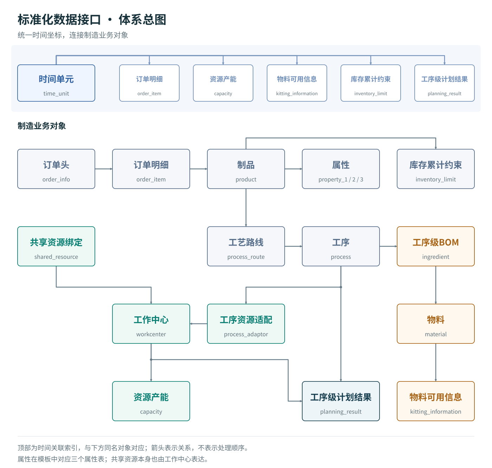

# DecisioWorks 标准化数据接口语义详解

[English](Interface-Semantics.md) · [学习指南](Interface-Guide-zh-CN.md) · [完整字段参考](Interface-Fields-zh-CN.md)

## 1. 从业务事实到生产决策

生产计划同时回答数量、时间、加工方式和资源分配问题。订单给出需求，工艺描述制造路径，资源和日历限定可用能力，物料与库存决定可执行条件。标准化数据接口把这些对象放入同一个语义体系，使输入可以被校验、转成模型条件，再将结果还原为业务记录。

业务层负责数据交换与服务调用；引擎层承载数学模型与决策模式，将业务对象组织为决策变量、约束和目标；算法层处理求解及其参数。三个层次通过明确的数据含义连接。业务系统可以调整数据来源，模型可以扩展表达，算法可以升级，而共同的业务含义保持稳定。

服务调用既包括计划功能，也包括参数、业务规则和目标配置。决策模式可以组织人工调整后重算、多计划协同、滚动更新及热启动等过程；具体采用哪种模式，应由相应能力入口与运行配置说明。标准化语义贯穿输入、模型转换与结果回传。

SQLite表是本专题使用的具体表达形式。CSV、JSON或外部系统的数据经过映射，也可以表达同样的对象关系。一个可复用模板应同时保留字段、关联、单位、配置规则和场景说明。

## 2. 体系总图

[查看原尺寸关系图](../../assets/data-interface/semantic-relationships-zh-CN.svg)

图中箭头用于阅读关联方向，不代表数据加载顺序或必然发生的业务动作。工作中心还可以组成父子结构；共享资源本身也用工作中心表达。

完整体系包括时间、工作中心、属性、制品、物料、订单头、订单明细、库存限制、工艺路线、工序、工序资源适配、工序级BOM、齐套、产能、共享资源和计划结果。属性机制在当前模板中展开为三个表，共形成18张标准表。

## 3. 标识、编码与关联

`id`是具体记录的引用标识，`code`用于业务编码，`name`用于名称说明。业务编码相同不能自动保证外键正确：订单明细中的`product`要指向实际的`product.id`。

设计说明中出现的`product_id`、`workcenter_id`、`process_id`等语义名称，在当前模板中分别实现为`product`、`workcenter`、`process`。订单头使用`order_info`，订单明细通过`information`引用它；明细交期字段为`delivery_time`。这些名称的对应见字段参考，含义保持一致。

在来源映射时保留来源主键、目标标识、单位转换与确认依据。一个字段缺失时，先确定业务含义：`NULL`可以表示未配置，数字0可能表示确实为零；两者不能统一替换。

## 4. 统一时间体系

`time_unit.id`用于引用；`offset`表示相对于计划起点的顺序位置；`scale`表示时间单元长度，单位为秒；`status`表达该单元的使用状态。

| 状态 | 语义 | 配置时需要确认 |
|---|---|---|
| `1` | 正常生产可用 | 各工作中心是否还有局部占用 |
| `0` | 不可用时间 | 休息、停产等条件是否适用于全局 |
| `-1` | 特殊或可选时间，如可选加班 | 当前计划是否采用、由什么配置决定采用 |

可选状态是一种业务状态，不能直接解释为负的可用时间。若运行模型需要已确定的日历，应先形成经确认的日历副本，再进行求解；仅写入`-1`不等于加班已经启用。

订单交期、资源产能、物料可用时间、库存限制和计划结果都引用同一时间基准。订单创建时间`created_at`保留原始时间戳，不承担计划窗口的含义。跨系统的日期、时区、班次归属和到料生效点，应先映射成统一的相对时间。

小时、班次和工作日可以作为不同任务的时间粒度。同一运行中的粒度及起点要能一致解释。时间编号的差值不是分钟数；换算应使用时间单元长度与计划起点。聚合为整班的可用分钟数，只表达总量；需要约束“中途连续停机”时，应细分时间单元或使用能够表达具体时窗的模型配置。

时间粒度需要与计划层级匹配。中长期产能规划关注时期总量，近期排程可能需要具体执行窗口。更细的时间表达会增加数据维护和计算负担，也可能提前固定本可灵活处理的安排；应在必要精度、执行协调和扰动后的调整空间之间权衡，而不是一律选择最细粒度。

## 5. 工作中心、日历与共享资源

工作中心可表示设备、设备组、班组、作业区域、外协单位、工装资源或组织单元。`parent_id`表达层级；`type=0`表示叶子节点，非0表示非叶子节点。`station_count`为工位数量，`parallelism`为并行数量，`equipping_time`为配置准备时间。

层级还承载三类业务含义：上层共性属性由下层继承并细化；优化规则可作用于工厂、车间或设备等不同层级；负荷、瓶颈和利用率可按父节点汇总。配置应说明继承值怎样解析、规则怎样落实到资源，以及汇总怎样避免重复计算。具体运行是否自动执行这些处理，需要由所用能力与配置确认。

工位数和并行数描述不同资源结构。它们怎样进入具体模型，应结合场景解释，不能一律把两者相乘作为产能。组织树也不意味着上下层产能可以重复汇总。

全局时间单元与各工作中心的`capacity`共同组成资源日历。`capacity.used`表示指定资源在指定时间单元内已经占用或不可用的比例，范围为0到1。正常时间内、在单资源且损失不重复计算的条件下：

`可用时间（秒） = scale × (1 − used)`

例如8小时共28800秒，维护2小时且无其他占用，`used=0.25`，可用21600秒。整段不可用可表达为`used=1`。源表中的件数、小时数先按明确基准换算为比例；维护与已有任务重叠时，按实际不可用时间的并集计算。

共享资源通过`shared_resource.binding`引用资源本身对应的工作中心，通过`to`引用使用它的目标工作中心。一套模具供两台设备使用，需要两条绑定关系和一套属于模具本身的能力记录。绑定关系表达谁依赖谁，可用能力表达能够使用多少；具体冲突限制由相应计划能力采用。

完整的产能数量表达为`availability(i,j)=scale(j)×(1−used(i,j))×|status(j)|`。绝对值使特殊/可选时段保留其可用量表达，不会产生负产能；是否使用该时段仍由计划策略决定。`status=0`时为零，`status=1`时即上面的正常时段简式。OEE等损失若另行采用，应明确核算位置，避免与`used`重复扣减。

## 6. 制品、属性与需求

制品可表示成品、半成品或零部件。`name/code`描述名称和编码，`vin`描述所属成品的唯一编码。仅凭相同`vin`不能推导零部件的装配数量，制造关系仍通过工艺与物料结构表达。

属性机制将制品按型号、配置、颜色等维度分类。属性的`name/code/value/is_key`分别描述属性名称、编码、值和关键属性标识；关键属性用于区分需求中的制品。一个`property_i`对应一个稳定分类维度，多个属性共同表达复合分类和规则条件。

每个属性维度构成对制品的一种分类划分，例如按颜色分为蓝、白、黑三类；属性组合可以描述产品族、系列、版本等层次。新增或调整分类时，要保持各分类与业务含义可追溯。

属性也为规则提供选择条件：

| 业务规则 | 属性如何参与 |
|---|---|
| 范围内数量限制 | 在一个班次内选择某型号，限制其产出数量 |
| 范围内种类限制 | 在一个批次内按颜色分组，限制颜色种类数 |
| 不同时生产或数量相关性 | 选择某配置组合，定义互斥或数量配比 |
| 经济批量 | 为某型号与配置组合设定批量区间 |
| 切换次数或批次数 | 用颜色等属性识别切换，并配置次数限制 |
| 不相邻生产 | 对深色后紧接浅色等顺序配置规则 |

这些条件通过相应服务接口与规则配置传入。属性记录提供分类事实，规则配置说明本次如何使用分类。

当前SQLite模板提供`property_1/2/3`，制品记录存放属性记录的外键。属性机制可以扩展；扩展时应同步处理字段、加载、映射、校验与模型采用方式。当前模板的`value`为数值字段，名称说明属性、编码标识类别，例如“颜色/BLUE/1”表示蓝色这一取值，不要直接把`BLUE`填入整数外键或数值列。

工程配置可通过`property_mappings`把`color`等业务名称对应到标准属性位置。语义中的“关键属性”与当前加载器通过`is_key`选取属性字段的行为应一并核对；规则确实引用某属性时，要确认它已被加载。

订单头描述订单、编码、优先级与创建时间；订单明细连接订单、制品、交付时间和需求数量。同一订单可以按制品及交期拆为多行。订单优先级、路线优先级、资源优先级与物料配套优先级各作用于自身对象，数值大小的排序规则由对应配置说明，不跨对象通用。

## 7. 工艺路线、工序与资源适配

一个制品可以有一条或多条候选路线；一条路线属于一个制品，包含一道或多道工序。路线名称、编码、描述和优先级用于表达加工方案与选择倾向。

`process.operation_number`标识路线内的工序编号；`seqno`表达顺序关系。不同工序可以有相同`seqno`，其语义是彼此没有先后依赖。它们是否能同时加工，还取决于资源、物料和模型采用方式。编号唯一性与顺序关系应分别检查。

`process_adaptor`连接工序和工作中心。一道工序可有多个资源适配记录，各自拥有优先级、出件率、批量、加工时间、切换时间、缓存容量、OEE和绑定加工标记。替换资源可能同时改变这些加工参数。

| 参数 | 语义及相互关系 |
|---|---|
| `productivity` | 离散加工的单次产出数量；连续加工设计中为单位时间产出，配置时必须明确量纲及转换方式 |
| `batch_size` | 按批加工的数量；离散加工中必须可由整数次加工组成，即为出件率的整数倍 |
| `processing_time` | 标准加工时长，单位为秒；当前离散模板按单次加工解释 |
| `setup_time` | 工艺切换时长，与工作中心配置时间分别确认，防止重复计入 |
| `wip_buffer_size` | 在制品缓存容量，配套说明容量单位及具体模型是否采用 |
| `OEE` | 设备综合效率；损失在哪一层计入必须明确 |
| `binding` | 相同组标识表示相关工序共同加工，需保持加工次数、时间与产出关系一致 |

离散加工中，`产出数量 = 加工次数 × 单次出件数量`。一批20件、每次4件，需要5次加工。需求必须整批满足属于具体业务策略：42件需求在20件整批条件下，可以讨论40件欠2件或60件余18件，不能把“需求是批量整数倍”推广为所有业务的统一要求。

共同加工与共享资源是两类不同关系：前者把若干产出连接到同一次加工，后者表达不同任务竞争同一有限资源。二者可以出现在同一场景中。

## 8. 物料、工序级BOM与齐套

物料包含名称、编码、供应商、替代组、依赖组和扩展信息。相同`substitute`表示可替代关系；`binding`描述选型依赖，例如轮毂与轮胎规格需要匹配。替代与依赖分别说明可换什么、哪些选择必须一起协调。

`ingredient`通过工序、物料、数量和优先级表达工序级BOM。数量描述该工序对应制品的配套需求，示例应明确以一件工序产出为基准，还是经过转换后的其他单位，不能把工序产出与设备加工次数混用。优先级在可替换物料情形下表达配套顺序，实际选择仍需对应策略采用。

`kitting_information`连接物料、时间单元和就绪数量，把当前库存和后续供给放入统一时间轴。语义上要回答“到这个时点有多少物料能够用于相应工序”。工程映射同时要约定记录的是本期新增可用量还是累计值：采用累计求和的输入链路时，应把期初可用量放入首期、后续增量放入对应时期，不能反复写入累计库存快照。退料、取消到货、冻结量变化需要经明确的重建或净额转换处理。

工序级齐套让不同物料在实际消耗点发生作用。例如切割使用坯料，装配使用紧固件；紧固件明天到达时，今天是否可以先切割，由工序顺序、在制品和时段安排共同决定。产品级BOM可以通过相应工序承载，但要保留真实的消耗位置。

## 9. 库存能力

`inventory_limit`将制品、时间、共用库存标记、累计上下限和紧迫性联系起来。它表达从当前库存、计划入库、计划出库和库存容量折算出的限制。`upper_bound_acc`与`lower_bound_acc`是累计数量界限，`binding`相同表示库存共用，`urgency`表达紧迫性或周转相关信息。

设期初库存为I0，截至t累计生产入库为P(t)，累计其他入库为E(t)，累计出库为D(t)，则：

`I(t) = I0 + P(t) + E(t) − D(t)`

若库存要求为`L(t) ≤ I(t) ≤ U(t)`，可以推导：

`L(t) − I0 − E(t) + D(t) ≤ P(t) ≤ U(t) − I0 − E(t) + D(t)`

累计生产不能为负，合法的负下界可取0；负上界意味着即使不生产也无法满足该库存上限，需要处理库存收支或限制条件。算出的界限与当前接口的整数、非负要求一起检查。共用库存还需要可比较的单位或换算基准，不能直接把不同尺寸制品的件数当成相同体积。

## 10. 数据交换、映射与校验

数据交换包括读取、解析、转换、校验、异常处理和结果输出。来源系统可以不同，统一含义与关系使同一场景能够复用计划能力。校验至少覆盖：字段存在、数据类型、数值范围、标识唯一、引用完整、时间坐标，以及需要启用的业务关系。

合理的检查顺序是：标识与主数据 → 时间与单位 → 路线和资源 → 物料与库存 → 配置采用 → 运行结果。时间连续性按统一的相对时间轴检查，明确非工作时段如何表示，避免交期或供给落入未定义的窗口。结构检查通过后，还要检查具体模型是否采用预期的约束与目标。

源数据、标准对象和模型输入视图分别保存。为某个模型选取主资源或做批量投影时，保留原始选择范围、原始需求、投影规则及影响说明。标准接口持续表达真实业务，模型视图表达本次运行采用的条件。

## 11. 工序级结果与反馈

`planning_result`通过工作中心、时间单元、工序和`number`表示在哪个资源、哪个时期完成哪道工序的多少产出。`number`表示产出数量，不能直接解释为加工次数。`value_1/2/3`为扩展字段，例如具体循环排程中可分别约定循环序号、序列位置及其他信息。

同一件制品经过两道工序时，两条工序产出不能相加作为成品交付量。应依据末工序、制品对应及所用路线恢复交付，再根据工序产出、出件率、时长与物料单耗恢复负荷和物料需求。

计划结果还可以为后续调整提供输入：已执行任务更新剩余需求，已占用资源更新产能，执行反馈更新物料与状态。滚动计划时，同时更新计划起点和所有时间引用。保留原始计划、执行事实、更新记录及下一轮配置，才能解释方案之间的变化。

结果可以输出为标准结构或写入指定结果库。读取原始业务数据不要求覆盖源数据库；显式结果写回与默认保留源数据可以共同组成可追溯的更新流程。

## 12. 如何使用本详解

下表用贯穿案例连接输入、计算含义和结果复核。数值为手算教学示例，不代表新增的求解运行记录。

| 输入事实与字段 | 本例计算含义 | 输出或反馈如何核对 |
|---|---|---|
| 订单80件，单次出件4件，每批20件 | 20次加工、4批；保留原始订单量 | 对应末工序`planning_result.number`合计80件，而非20次 |
| 正常期`scale=28800`、`used=0.25`、`status=1` | 可用21600秒，即360分钟 | 冲压20次×600秒=200分钟，余160分钟；不重复扣维护 |
| 冲压坯料单耗1件，需产80件 | 本工序物料需求80件 | 核对该工序消耗时点之前的供给和累计消耗 |
| 冲压和装配各产80件 | 两道工序表达流转，不是160件成品 | 按末工序、路线与订单分配依据恢复交付量 |
| 实际交付60件，原承诺80件 | 交付偏差20件 | 下一轮结合库存、在制品和已完工未交付量计算剩余任务 |

按[九课教程](Interface-Guide-zh-CN.md)逐步完成配置，通过[字段参考](Interface-Fields-zh-CN.md)确认类型与空值，通过[关系参考](Interface-Relationships-zh-CN.md)检查跨表约束，再用[贯穿案例](Interface-Walkthrough-zh-CN.md)完成一次完整核对。

语义定义说明数据能表达什么；字段字典说明当前模板如何存储；能力配置与运行证据说明某次求解实际采用了什么。将三者对应起来，使用者就能在保持业务含义的前提下调整数据、替换来源系统并持续完善场景。
