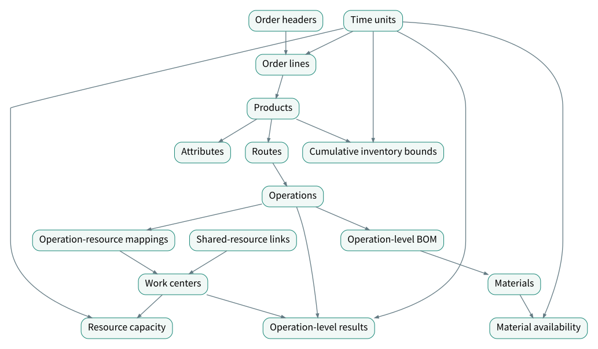

# DecisioWorks Standardized Data Interface: A Detailed Semantic Guide

[中文](Interface-Semantics-zh-CN.md) · [Learning guide](Interface-Guide.md) · [Complete field reference](Interface-Fields.md)

## 1. From Business Facts to Production Decisions

A production plan addresses quantities, timing, manufacturing methods, and resource allocation together. Orders express demand; routes describe manufacturing; resources and calendars limit capacity; materials and inventory determine executable conditions. The standardized interface connects these objects so that inputs can be validated and translated into model conditions, then results can be restored to business records.

The business layer handles data exchange and service calls. The engine layer contains mathematical models and decision modes, organizing facts into decision variables, constraints, and objectives. The algorithm layer handles solving and its parameters. Shared meanings connect the layers while data sources, model capabilities, and algorithms evolve independently.

Service calls cover planning functions as well as parameter, business-rule and objective configuration. Decision modes can organize manual adjustment and reruns, coordinated plans, rolling updates and warm starts. The selected capability entry point and run configuration determine the mode actually used. Consistent semantics connect the input, model translation and returned results.

SQLite tables are the concrete representation used here. Mapped CSV, JSON, or external-system data can express the same relationships. A reusable template preserves fields, relationships, units, configuration rules, and the scenario description together.

## 2. System Map

[Open the full-size relationship diagram](../../assets/data-interface/semantic-relationships-en.svg)

Arrows show relationships for reading, rather than loading order or mandatory business actions. Work centers also form parent-child structures. A shared resource is itself represented as a work center.

The complete system includes time, work centers, attributes, products, materials, order headers and lines, inventory limits, routes, operations, operation-resource mappings, operation-level BOM, kitting, capacity, shared resources, and planning results. Three physical attribute tables bring the current standard template to 18 tables.

## 3. Identifiers, Codes, and References

An `id` identifies a record for referencing; a `code` holds a business code; a `name` supplies a readable label. Matching business codes do not make a foreign key valid: `order_item.product` must resolve to an actual `product.id`.

Semantic names such as `product_id`, `workcenter_id`, and `process_id` appear as `product`, `workcenter`, and `process` in the current template. `order_info` stores order headers, referenced by `order_item.information`; `delivery_time` is the order-line time reference. The field reference documents these naming correspondences.

Keep source keys, target identifiers, unit conversions, and the basis for each mapping. Determine the business meaning of a missing value: `NULL` may mean unspecified, while zero can mean a known quantity of zero. Treat them separately.

## 4. A Common Time System

`time_unit.id` is the reference key. `offset` expresses order relative to the planning origin. `scale` gives the length of the unit in seconds. `status` states how the period can be used.

| Status | Meaning | Configuration question |
|---|---|---|
| `1` | Normally available | Does a work center have additional local occupancy? |
| `0` | Unavailable | Does the shutdown or break apply globally? |
| `-1` | Special or optional, such as optional overtime | Is the period adopted, and which configuration controls that choice? |

Optional status is a business state, not negative available time. When a model requires a resolved calendar, create an approved calendar view before solving. Entering `-1` alone does not activate overtime.

Due dates, resource capacity, material availability, inventory limits, and results reference the same time basis. `created_at` retains the order creation timestamp rather than describing a planning window. Map source dates, time zones, shift membership, and receipt-effective times into a consistent relative coordinate.

Hours, shifts, and working days suit different planning tasks. Within a run, the origin and granularity must be interpretable consistently. Differences between IDs are not elapsed minutes. Use the period lengths and planning origin for conversion. A shift-level total expresses aggregate availability; an interruption at a specific point requires finer periods or a model configuration that represents that window.

Match granularity to the planning level. Medium- and long-term capacity planning concerns period totals, while near-term scheduling may require specific execution windows. Finer representation increases data-maintenance and computational demands and may fix arrangements that could remain flexible. Balance necessary precision, execution coordination, and room to adjust after disruptions rather than always choosing the finest resolution.

## 5. Work Centers, Calendars, and Shared Resources

A work center can represent a machine, machine group, team, area, subcontractor, tool, or organizational unit. `parent_id` defines hierarchy; `type=0` identifies a leaf, and a nonzero type identifies a non-leaf. `station_count` counts stations, `parallelism` describes parallel units, and `equipping_time` records configuration or preparation time.

Hierarchy also supports three business meanings: lower levels inherit and refine common attributes; optimization rules can apply at plant, shop, or machine level; and load, bottlenecks, and utilization can be aggregated by parent node. Define how inherited values are resolved, how rules reach resources, and how aggregation avoids double counting. Whether these steps run automatically depends on the selected capability and configuration.

Stations and parallel units describe different resource structures. Their model interpretation depends on the scenario; multiplying them universally would be incorrect. A resource hierarchy also does not justify counting parent and child capacity twice.

Global time units and local `capacity` records form each resource calendar. `capacity.used` is the occupied or unavailable fraction for that resource and period, from 0 to 1. In a normal period, for one resource and without duplicated losses:

`available seconds = scale × (1 − used)`

An eight-hour period is 28,800 seconds. Two hours of maintenance with no other occupancy gives `used=0.25` and 21,600 available seconds. A fully unavailable period can use `used=1`. Convert source hours or quantities using an explicit capacity baseline. Overlapping maintenance and committed work must use the union of unavailable intervals.

`shared_resource.binding` references the work center representing the shared resource; `to` references a dependent work center. One mold serving two machines needs two links and one calendar belonging to the mold. Links express dependence, while capacity records express availability. The relevant planning capability must apply the resulting conflict restriction.

The complete capacity expression is `availability(i,j)=scale(j)×(1−used(i,j))×|status(j)|`. The absolute value preserves an availability quantity for special or optional periods without creating negative capacity; planning policy still determines whether to use that period. A status of 0 gives zero, while 1 gives the normal-period expression above. If OEE or another loss is also applied, specify its accounting layer to avoid counting the same loss again in `used`.

## 6. Products, Attributes, and Demand

A product can be a finished item, intermediate item, or component. `name/code` identify it; `vin` identifies the finished item to which it belongs. A shared `vin` does not determine assembly quantities; routes and material relationships still express manufacturing.

Attributes classify products by model, configuration, color, or other dimensions. `name/code/value/is_key` express the attribute name, code, value, and key-attribute flag. Key attributes distinguish products in demand. Each `property_i` describes a stable classification; combinations express composite categories and rule conditions.

Each dimension partitions products into categories, such as blue, white and black for color. Combinations can describe product families, series and versions. Keep category meanings traceable when adding or changing classifications.

Attributes also select the products to which a rule applies:

| Business rule | How attributes participate |
|---|---|
| Quantity within a scope | Select a model and limit its output within a shift |
| Number of categories | Group a batch by color and limit distinct colors |
| Mutual exclusion or quantity relationships | Select configuration combinations and define exclusion or ratios |
| Economic batch size | Set a batch-size range for a model/configuration combination |
| Changeover or batch counts | Identify transitions through color or another attribute and limit their count |
| Prohibited adjacency | Configure rules for sequences such as a dark color immediately followed by a light color |

Pass these conditions through the relevant service interface and rule configuration. Attribute records supply classification facts; the rules state how a particular run uses them.

The current SQLite template supplies `property_1/2/3`, referenced by foreign keys in product records. Extending the mechanism requires coordinated schema, loading, mapping, validation, and model support. The current `value` column is numeric. A name identifies the attribute and a code identifies the category: “Color/BLUE/1” represents blue. Do not write `BLUE` into an integer foreign key or numeric column.

`property_mappings` can map a business name such as `color` to a standard attribute position. Check both the meaning of a key attribute and the current loader's use of `is_key` to select attribute fields. An attribute referenced by a rule must actually be loaded.

Order headers describe the order, code, priority, and creation timestamp. Lines link the order, product, due period, and quantity. Split an order by product and due period when needed. Order, route, resource, and material priorities act on different objects; their numeric sorting conventions belong to the corresponding configuration.

## 7. Routes, Operations, and Resource Mappings

A product can have one or several candidate routes. Each route belongs to one product and contains one or more operations. Route names, codes, descriptions, and priorities express manufacturing alternatives and selection preferences.

`process.operation_number` identifies an operation within its route; `seqno` expresses precedence. Equal `seqno` values mean no precedence between those operations. Simultaneous execution also depends on resources, materials, and model behavior. Check numbering uniqueness separately from precedence.

`process_adaptor` connects an operation to a work center. Alternative mappings can have different priorities, outputs, batches, durations, changeovers, buffers, efficiency, and joint-processing groups. Changing a resource may change several of these parameters.

| Parameter | Meaning and relationship |
|---|---|
| `productivity` | Output per processing cycle for discrete manufacturing; output per unit time in a continuous interpretation, with explicit units and conversion |
| `batch_size` | Batch quantity; in the discrete case it must be an integer multiple of per-cycle output |
| `processing_time` | Standard duration in seconds; interpreted per processing cycle by the current discrete template |
| `setup_time` | Operation changeover duration, distinguished from work-center preparation to avoid double counting |
| `wip_buffer_size` | Work-in-process buffer capacity, with its units and model usage specified |
| `OEE` | Overall equipment effectiveness; identify the layer where its losses are accounted for |
| `binding` | A common group joins operations processed together; cycles, durations, and outputs must be consistent |

For discrete processing, `output quantity = processing cycles × output per cycle`. A 20-unit batch at four units per cycle requires five cycles. Exact demand-to-batch divisibility is a scenario policy, not a universal demand rule. With a requirement of 42 and batches of 20, producing 40 leaves a shortage of two; producing 60 creates a surplus of 18.

Joint processing and shared resources express different relationships. Joint processing connects outputs to the same processing event; shared resources express competition for limited capacity. Both can coexist.

## 8. Materials, Operation-Level BOM, and Kitting

Materials carry a name, code, vendor, substitute group, dependency group, and extension information. Equal `substitute` values identify alternatives. `binding` expresses dependent choices, such as compatible wheels and tires. The two relationships answer different questions: what can be replaced, and which selections must be coordinated.

`ingredient` defines the operation-level BOM through an operation, material, quantity, and priority. State the quantity basis explicitly: one unit of operation output or another documented converted unit. Operation output and machine cycles must not be mixed. Priority expresses material selection preference where alternatives exist and requires a corresponding selection policy.

`kitting_information` connects a material, time unit, and ready quantity, placing initial availability and later supply on one axis. The semantic question is how much material is available for the relevant operation by a point in time. The input mapping must also state whether rows hold incremental or cumulative quantities. A chain that cumulatively sums inputs expects initial availability once in the first period and later increments in their periods; repeatedly entering cumulative stock snapshots would overstate supply. Returns, canceled receipts, and changes in blocked stock need an explicit reconstruction or netting policy.

Operation-level kitting places each requirement at its actual consumption step. Cutting may consume blanks while assembly consumes fasteners. If fasteners arrive tomorrow, cutting today depends on precedence, intermediate inventory, and period allocation. Product-level BOM can be carried through the appropriate operation while preserving the actual consumption point.

## 9. Inventory Capacity

`inventory_limit` connects a product, period, shared-inventory group, cumulative upper and lower bounds, and urgency. These bounds are derived from initial stock, planned receipts and issues, and storage requirements. Equal `binding` values express shared inventory; `urgency` carries urgency or turnover-related information.

Let I0 be opening inventory, P(t) cumulative production receipts, E(t) cumulative other receipts, and D(t) cumulative issues:

`I(t) = I0 + P(t) + E(t) − D(t)`

If `L(t) ≤ I(t) ≤ U(t)`, then:

`L(t) − I0 − E(t) + D(t) ≤ P(t) ≤ U(t) − I0 − E(t) + D(t)`

Cumulative production cannot be negative, so a valid negative lower bound may become zero. A negative upper bound means that even zero production would violate the inventory ceiling; review the inventory balance or requirement. Check the resulting bounds against the current integer and nonnegative input rules. Shared inventory also requires comparable units or a conversion basis; counts of differently sized products are not automatically comparable storage volumes.

## 10. Exchange, Mapping, and Validation

Exchange includes reading, parsing, conversion, validation, error handling, and result output. Different source systems can supply the same business meanings. Validate field presence, types, ranges, unique identifiers, references, time coordinates, and the relationships needed by the selected capability.

A useful order is identifiers and master data, time and units, routes and resources, materials and inventory, adopted configuration, then results. Check time continuity against the shared relative axis and document nonworking periods, so due dates and supplies do not fall into undefined windows. Structural validity is followed by a check that the selected model actually uses the intended constraints and objectives.

Keep source data, standardized objects, and model-input views separate. When projecting a primary resource or a whole-batch requirement for one run, retain the original alternatives, original demand, transformation rule, and its effect. Standard data expresses the business; a model view expresses the conditions adopted for that run.

## 11. Operation-Level Results and Feedback

`planning_result` records the work center, period, operation, and output `number`. The quantity is output, not processing cycles. `value_1/2/3` are extension fields; a circular scheduling configuration may use them for cycle number, sequence position, and another documented value.

If an item passes through two operations, adding both operation quantities does not give finished deliveries. Recover delivery through final operations, product ownership, and route selection. Use operation output, cycle output, duration, and material coefficients to recover workload and material requirements.

Results also support subsequent changes. Executed work updates remaining demand, committed work updates occupied capacity, and execution feedback updates material availability and state. Rolling planning requires the origin and every time reference to move consistently. Retain the original plan, execution facts, changes, and next-run configuration to explain differences.

Results can be exported in the standard structure or written to an explicit result database. Reading a business source does not require overwriting it. Explicit result persistence and source preservation can coexist in a traceable update process.

## 12. Using This Guide

This table connects the running example's inputs, calculation meanings, and result checks. The figures are hand-calculated teaching examples, not new solver-run evidence.

| Input fact and fields | Meaning in this example | Output or feedback check |
|---|---|---|
| Demand 80 units, output 4 per cycle, batch quantity 20 | 20 cycles and 4 batches; retain original demand | Relevant final-operation `planning_result.number` totals 80 units, not 20 cycles |
| Normal period: `scale=28800`, `used=0.25`, `status=1` | 21600 available seconds, or 360 minutes | Stamping takes 20×600 seconds = 200 minutes, leaving 160; do not deduct maintenance twice |
| One blank per stamped unit, output requirement 80 | This operation requires 80 blanks | Check supply before consumption and cumulative material use |
| Stamping and assembly each output 80 units | Two operations describe flow, not 160 finished units | Recover deliveries using final operations, routes, and an order-allocation basis |
| Actual delivery 60 against a commitment of 80 | Delivery deviation is 20 units | Calculate remaining work using stock, work in process, and finished but undelivered quantities |

Follow the [nine lessons](Interface-Guide.md), consult the [field reference](Interface-Fields.md) for types and nulls, check the [relationship reference](Interface-Relationships.md), and complete the [end-to-end exercise](Interface-Walkthrough.md).

Semantic definitions describe what data expresses. The field dictionary documents current storage. Capability configuration and execution evidence establish what a particular solve used. Connecting these three lets users change data, replace source systems, and extend scenarios while preserving meaning.
